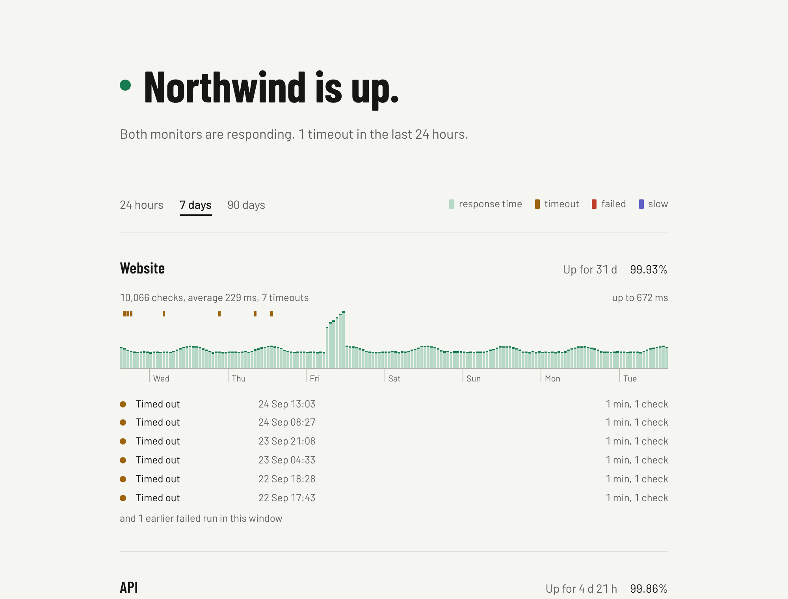

# statoss-standalone

[](https://github.com/kroqdotdev/statoss-standalone/actions/workflows/ci.yml)
[](LICENSE)

A self-hosted status page in one container. It checks your URLs, ports, DNS records, certificates, domains and scheduled jobs every minute, stores every result in SQLite, and serves a public page for each site on its own hostname, with incidents, maintenance windows, components, alerts to email, Slack, Discord, PagerDuty, Opsgenie, ntfy and webhooks, and a JSON, badge, RSS, Atom, calendar and widget endpoint next to every page.



## Features

- **Every failed check is visible.** Each monitor has a strip of bars. Bar height is response time. A mark at the top of a bar shows the failed checks in that time slot: amber for a timeout, red for any other failure. One failed check out of 1,440 in a day still gets a visible mark.
- **Four views.** The last 24 hours in 5-minute slots, 7 days in 1-hour slots, and 90 days or a year in 1-day slots. Point at a bar, or use the arrow keys, to read the numbers for one slot and the incidents that touched it. Click a bar, or press Enter, to list the checks behind it and where each one's time went: the DNS lookup, the connection, the TLS handshake and the first byte.
- **An error budget.** Give a site an uptime target and the page says how much of the month's allowance of downtime is spent.
- **Failed checks are listed.** Consecutive failures are grouped into runs. Each run shows the reason (timeout, HTTP status, keyword, or connection error), when it started, and how long the monitor did not respond.
- **Seven kinds of monitor.** HTTP, TCP port, DNS, ping, certificate expiry, domain expiry, and a heartbeat that a scheduled job pings.
- **Any request.** An HTTP monitor can use any method, send headers and a body, expect an exact status, and require a keyword in the response, or require its absence.
- **Slow is a state.** Give a monitor a threshold and it turns slow after two slow responses and back after one fast one. Slow buckets are drawn in indigo under a dashed line at the threshold.
- **Groups.** Monitors with the same group name are shown together under one heading with a one-line summary.
- **Components.** A part of the product with no check, such as a mobile app, shown with a state you set or an incident sets.
- **Incidents and maintenance.** Write incidents as Markdown or YAML files in a folder; the page picks them up without a restart. Every incident and window has a page of its own, and older ones are listed by month under Incident history. Plan maintenance windows in the configuration, once or every week or month: checks during a window are shown but not counted, and no alert goes out. A monitor that goes down opens an incident by itself and resolves it on recovery.
- **Alerts where you are.** Email, Slack, Discord, PagerDuty, Opsgenie, ntfy and a signed webhook, per site or for all of them, with an optional repeat while a monitor stays down. Incident updates and maintenance notices go the same way, and a vendor's outage goes to email, Slack, Discord and ntfy.
- **Endpoints for machines.** `status.json`, `badge.svg` and `badge.json` for shields.io, `feed.xml` and `feed.atom`, `maintenance.ics` for calendar apps, and `widget.js` to embed a live status dot anywhere.
- **Your look.** A logo, a favicon, an accent colour, a fixed light or dark theme, a description and a support link, per site.
- **Times where the visitor is.** Every time on the page is written in the visitor's own time zone.
- **Password pages.** A site can ask for a password, which locks its endpoints too, with a key for embeds.
- **One YAML file.** No admin interface, no accounts, no external services.
- **One process.** A Next.js server with an embedded checker and a SQLite file. Deploy it with Docker Compose behind any reverse proxy.

## How it works

You list sites in `config.yaml`. Each site has a hostname and one or more monitors. A monitor has a type, `http` unless you say otherwise. An HTTP monitor is a URL and, optionally, the method, headers and body to send, the HTTP status you expect, a keyword the response must contain, a slow threshold, and a group. The other types are described under [Monitor types](#monitor-types).

The checker runs inside the server process:

1. Every `checkIntervalSeconds`, it runs every monitor that is due, with a 10-second timeout. After a restart a monitor is due when its interval has passed since its last check, not at once. A monitor whose last check is still waiting on its timeout is left to finish; the others go ahead. A monitor with `intervalSeconds` runs less often. The checks of one round are spread over the first three quarters of the interval (45 seconds at most) so that they do not slow each other down.
2. An HTTP check passes on a 2xx response, or on the exact `expectStatus` if you set one, and, with a `keyword`, only when the body contains it (or does not, with `keywordMode: absent`). Bodies are read up to 1 MB.
   HTTP, TCP and certificate checks open a connection of their own each time and time each step: the DNS lookup, the TCP connection, the TLS handshake and, for HTTP, the wait for the first byte of the response. A host's addresses are tried side by side, the next one starting a quarter second after the last, and the first to answer is used. The list of checks behind a bar shows the steps; a check that timed out says where it stopped.
3. A monitor becomes **down** after 2 failed checks in a row and **up** again after 1 successful check. With a `slowThresholdMs`, it becomes **slow** after 2 successful checks over the threshold and back to normal after 1 under it. Each change of state sends one alert to every destination of the site. With `repeatMinutes`, a monitor that stays down sends a "still down" notice at that interval.
4. A monitor going down opens an incident on the page; the first success after it resolves the incident.
5. Checks made inside a maintenance window are stored with a flag. The page shows them in grey and leaves them out of every total, and they change no state and send no alert.
6. Every check is kept for `retentionDays` (90 unless you change it). Each check is also added to its hour's totals, which are kept for 400 days and are what the 7-day, 90-day and 1-year views and the error budget read. Older rows are deleted once a day.

The server reads the `Host` header of each request and shows the site with the matching hostname. Any other hostname gets a 404.

## Requirements

- Docker, to run it. Docker Compose is optional.
- A reverse proxy that terminates TLS, for example Caddy or nginx.
- Node.js 22 and pnpm, only if you want to develop it.

## Quick start

A ready image is published for linux/amd64 and linux/arm64:

```
ghcr.io/kroqdotdev/statoss-standalone
```

`latest` follows the main branch. Releases are also tagged by version, for example `1.2.3`, `1.2` and `1`. Every build is tagged `sha-` and the short commit hash.

The container runs as the `node` user (user ID 1000). It reads `/data/config.yaml`, reads incidents from `/data/incidents`, and keeps its database in `/data/status.db`.

### Run the image with docker run

1. Download the example configuration and edit it. The file explains every field.

   ```sh
   curl -o config.yaml https://raw.githubusercontent.com/kroqdotdev/statoss-standalone/main/config.example.yaml
   ```

2. Start the container:

   ```sh
   docker run -d --name statoss --restart unless-stopped -p 127.0.0.1:3000:3000 -v "$PWD/config.yaml:/data/config.yaml:ro" -v statoss-data:/data ghcr.io/kroqdotdev/statoss-standalone:latest
   ```

The database is kept in the `statoss-data` volume. For email alerts, add `-e SMTP_PASS=your-password`. To write incident files on the host, create an `incidents` folder and add `-v "$PWD/incidents:/data/incidents:ro"`.

### Run the image with Docker Compose

1. Create a folder for it with a `data` directory and the example configuration:

   ```sh
   mkdir -p statoss/data && cd statoss
   curl -o data/config.yaml https://raw.githubusercontent.com/kroqdotdev/statoss-standalone/main/config.example.yaml
   ```

2. Edit `data/config.yaml`. The example file explains every field.
3. Save this as `docker-compose.yml`:

   ```yaml
   services:
     statoss:
       image: ghcr.io/kroqdotdev/statoss-standalone:latest
       restart: unless-stopped
       ports:
         - "127.0.0.1:3000:3000"
       environment:
         - SMTP_PASS=${SMTP_PASS}
       volumes:
         - ./data:/data
   ```

4. If you use email alerts, put the SMTP password in `.env`:

   ```sh
   echo 'SMTP_PASS=your-password' > .env
   ```

   Any other secret the configuration refers to as `${NAME}` goes in `.env` too, and in the `environment` list of `docker-compose.yml`, so the container can see it.

5. Make the `data` directory writable by user ID 1000 and start the container:

   ```sh
   sudo chown -R 1000:1000 data
   docker compose up -d
   ```

### Build from source

1. Clone the repository and enter it.
2. Create the data directory and the configuration, then edit `data/config.yaml`:

   ```sh
   mkdir data
   cp config.example.yaml data/config.yaml
   ```

3. Put secrets in `.env` as in the Compose steps above.
4. Build and start the container. `docker-compose.build.yml` adds the build to the Compose file in the repository.

   ```sh
   sudo chown -R 1000:1000 data
   docker compose -f docker-compose.yml -f docker-compose.build.yml up -d --build
   ```

### Put it online

The container listens on `127.0.0.1:3000`.

1. Point your reverse proxy at it. For Caddy, add one block for each site:

   ```
   status.example.com {
       reverse_proxy 127.0.0.1:3000
   }
   ```

2. Create a DNS record for each status hostname.

Open `https://status.example.com` to see the page.

## Configuration

`config.yaml` is read once at startup. Restart the container after you change it. Write `${NAME}` anywhere in the file to use the environment variable `NAME`; an unset variable is an error.

| Field                                | Required | Default          | Description                                                                                                  |
| ------------------------------------ | -------- | ---------------- | ------------------------------------------------------------------------------------------------------------ |
| `checkIntervalSeconds`               | no       | `60`             | Seconds between checks. Minimum 10.                                                                          |
| `alerts.smtp.host`                   | no       |                  | SMTP server. Needed for email destinations.                                                                  |
| `alerts.smtp.port`                   | no       |                  | `465` uses TLS from the start. Other ports require STARTTLS.                                                 |
| `alerts.smtp.user`                   | no       |                  | SMTP login. The password comes from the `SMTP_PASS` variable.                                                |
| `alerts.smtp.from`                   | no       |                  | Sender address.                                                                                              |
| `alerts.smtp.to`                     | no       |                  | A shorthand for one email destination in `alerts.to`.                                                        |
| `alerts.to[]`                        | no       | `[]`             | Destinations for every site without a list of its own. See below.                                            |
| `alerts.repeatMinutes`               | no       | `0`              | Minutes between "still down" notices while a monitor stays down. `0` sends none.                             |
| `alerts.updates`                     | no       | `true`           | `false` sends no incident updates or maintenance notices to the destinations.                                |
| `alerts.vendors`                     | no       | `true`           | `false` sends nothing when a vendor a component follows changes state. See Vendor components.                |
| `sites[].name`                       | yes      |                  | Shown in the headline, for example `example.com is up.`                                                      |
| `sites[].host`                       | yes      |                  | Hostname that serves this site's page. Must be unique.                                                       |
| `sites[].url`                        | no       | `https://<host>` | Where alerts and feeds link to.                                                                              |
| `sites[].description`                | no       |                  | A sentence or two under the headline.                                                                        |
| `sites[].logo`, `favicon`            | no       |                  | An image file next to the configuration, or an http(s) address. See The look of a page.                      |
| `sites[].accent`                     | no       |                  | The colour of links, focus rings and buttons, as `"#rrggbb"`.                                                |
| `sites[].theme`                      | no       | `auto`           | `light` or `dark` to fix it; `auto` follows the visitor's system.                                            |
| `sites[].supportUrl`                 | no       |                  | Where "Contact support" goes: an http(s) or `mailto:` address.                                               |
| `sites[].timezone`                   | no       | `UTC`            | The zone times are written in until the browser says its own, and the one the history and repeats follow.    |
| `sites[].noindex`                    | no       | `false`          | `true` asks search engines to leave the page out.                                                            |
| `sites[].defaultRange`               | no       | `24h`            | The view the page opens on: `24h`, `7d`, `90d` or `1y`.                                                      |
| `sites[].foldGroups`                 | no       | `false`          | `true` folds away the groups in which everything is up.                                                      |
| `sites[].password`                   | no       |                  | With a password, the page and its endpoints are locked. See Password pages.                                  |
| `sites[].embedKey`                   | no       |                  | Lets embeds past the password with `?key=`. At least 8 letters, digits, dashes or underscores.               |
| `sites[].uptimeTarget`               | no       |                  | Percent of checks that should pass each month, for example `99.9`. Shows the error budget.                   |
| `sites[].alerts`                     | no       |                  | `false` to send no alerts for this site, or an object holding `to`, `repeatMinutes`, `updates` or `vendors`. |
| `sites[].monitors[].name`            | yes      |                  | Shown above the strip. Must be unique within the site.                                                       |
| `sites[].monitors[].type`            | no       | `http`           | `http`, `tcp`, `dns`, `ping`, `certificate`, `domain` or `heartbeat`. See Monitor types.                     |
| `sites[].monitors[].url`             | for http |                  | The URL to request.                                                                                          |
| `sites[].monitors[].intervalSeconds` | no       |                  | Seconds between this monitor's checks, when longer than `checkIntervalSeconds`.                              |
| `sites[].monitors[].group`           | no       |                  | Monitors with the same group are shown together.                                                             |
| `sites[].monitors[].method`          | no       | `GET`            | `GET`, `HEAD`, `POST`, `PUT`, `PATCH` or `DELETE`.                                                           |
| `sites[].monitors[].headers`         | no       |                  | Request headers, as a map.                                                                                   |
| `sites[].monitors[].body`            | no       |                  | Request body, sent as-is with every method but `GET` and `HEAD`.                                             |
| `sites[].monitors[].expectStatus`    | no       | any 2xx          | The check passes only on this exact status. 3xx is not followed.                                             |
| `sites[].monitors[].keyword`         | no       |                  | Text the response body must contain.                                                                         |
| `sites[].monitors[].keywordMode`     | no       | `present`        | `absent` fails the check when the keyword is found.                                                          |
| `sites[].monitors[].slowThresholdMs` | no       |                  | A successful response slower than this counts as slow. At most 9999. For http, tcp, dns and ping.            |
| `sites[].components[].vendor`        | no       |                  | A vendor's status page to follow. See Vendor components.                                                     |
| `sites[].components[].part`          | no       |                  | One component on the vendor's page, by its name there.                                                       |
| `sites[].showDeploys`                | no       | `true`           | `false` keeps deploy markers off the strips.                                                                 |
| `sites[].maintenance[].title`        | yes      |                  | Shown on the page while the window is planned, running, or in the last 30 days.                              |
| `sites[].maintenance[].start`, `end` | yes      |                  | ISO 8601. A date and time without a zone is read as UTC.                                                     |
| `sites[].maintenance[].monitors`     | no       | all              | Names of the monitors the window covers.                                                                     |
| `sites[].maintenance[].notes`        | no       |                  | A sentence or two, shown under the title.                                                                    |
| `sites[].maintenance[].repeat`       | no       |                  | `weekly`, `monthly` or `monthly-weekday`. See Maintenance windows.                                           |
| `sites[].maintenance[].until`        | no       |                  | With `repeat`, the last day a repeat may start on, like `2027-03-31`.                                        |

A configuration written for 0.1 that says `checkpoints` where this one says `monitors` still works.

### Monitor types

Every type but `http` takes a `host` instead of a `url`. A field that does not belong to a monitor's type is an error.

| Type          | Fields                                   | Passes when                                                                                                                                                                                |
| ------------- | ---------------------------------------- | ------------------------------------------------------------------------------------------------------------------------------------------------------------------------------------------ |
| `http`        | `url` and the request options above      | The response has a 2xx status, or the one you expect, and the keyword matches.                                                                                                             |
| `tcp`         | `host`, `port`                           | The port accepts a connection.                                                                                                                                                             |
| `dns`         | `host`, `record` (default `A`), `expect` | The name has a record of that type (`A`, `AAAA`, `CNAME`, `MX`, `TXT` or `NS`) and, with `expect`, one answer contains that text.                                                          |
| `ping`        | `host`                                   | One ICMP echo is answered. The image carries `ping`; elsewhere a missing `ping` command is reported as such.                                                                               |
| `certificate` | `host`, `port` (default 443), `warnDays` | The TLS certificate is valid for the host and does not expire within `warnDays` (default 14). Checked once an hour at most.                                                                |
| `domain`      | `host`, `warnDays`                       | The registry (through rdap.org) says the domain does not expire within `warnDays` (default 30). Checked every six hours at most.                                                           |
| `heartbeat`   | `token`, `intervalSeconds`               | Your job requested `/heartbeat/<token>` within the last `intervalSeconds`, with a tenth of it (a minute at least) as grace. Judged every round; nothing is recorded before the first ping. |

```yaml
monitors:
  - name: Database
    type: tcp
    host: db.example.com
    port: 5432
  - name: Mail records
    type: dns
    host: example.com
    record: MX
    expect: mail.example.com
  - name: Certificate
    type: certificate
    host: example.com
    warnDays: 21
  - name: Nightly backup
    type: heartbeat
    token: ${BACKUP_HEARTBEAT}
    intervalSeconds: 86400
```

A heartbeat is for a job that runs on a schedule. End the job with a request to `https://status.example.com/heartbeat/<token>`, with any method, for example `curl -fsS https://status.example.com/heartbeat/$BACKUP_HEARTBEAT`. The token is at least 8 letters, digits, dashes or underscores, and no two monitors may share one. Set `intervalSeconds` to how often the job runs. The monitor is judged every round (`checkIntervalSeconds`): it fails once no ping has come for the interval and its grace, and goes down on the second failure in a row, a round later. A ping to a monitor that is down is judged at once, so the recovery shows without waiting for the next round.

Certificate and domain monitors show the date they expire on the page and in `status.json`, an expired or untrusted certificate included. They, and heartbeats, have no response time, so their strips are drawn at one height.

A destination is one entry in a `to` list, of one of these shapes:

```yaml
- email: alerts@example.com
- slack: https://hooks.slack.com/services/T000/B000/XXXX
- discord: https://discord.com/api/webhooks/000/XXXX
- webhook: https://example.com/statoss
  secret: ${WEBHOOK_SECRET}
- pagerduty: ${PAGERDUTY_KEY} # an Events API v2 integration key
- opsgenie: ${OPSGENIE_KEY}
  region: eu # optional, for an account on api.eu.opsgenie.com
- ntfy: https://ntfy.sh/my-topic
  token: ${NTFY_TOKEN} # optional, for a protected topic
```

On PagerDuty and Opsgenie a monitor going down opens an alert and its recovery closes the same one; slowness opens a second, lower one (warning, P3) that ends when the monitor is back to normal speed, or when it goes down. ntfy gets the message as text with a title, a priority and a link to the page.

A down alert says when the first failed check was. A send that does not get through is tried again after one, five and fifteen minutes, and dropped if the monitor has changed state in the meantime, even if it has since come back to the same state. Every send, failure and retry is written to the log with `[alerts]` in front, which is the record of what was delivered.

The webhook receives a JSON body with `event` (`went-down`, `recovered`, `went-slow`, `back-to-normal` or `still-down`), `site`, `monitor` (also sent as `checkpoint`, its name in 0.1), `url` (what the monitor points at: the URL, `host:port`, or the host), `pageUrl`, `error`, `downSince`, `failingSince`, `latencyMs`, `thresholdMs` and `at`, an `X-StatOSS-Event` header, and an `X-StatOSS-Signature` header holding `sha256=` and the hex HMAC-SHA256 of the raw body under the secret.

### Incident updates and maintenance notices

The same destinations get what you write, not only what the checks find:

- every update on an incident file, once, when it is saved with a time in the last hour (an incident with no updates counts as one);
- a maintenance window when it is first seen in the configuration, when it starts, and when it is over. Each repeat of a window is first seen a week before it starts.

An update dated more than an hour ago is not sent, so an incident written up afterwards tells nobody. An update dated ahead is sent when its time comes. What has gone out is kept in the database, so a restart repeats nothing. PagerDuty and Opsgenie get none of these: they page people, and an update is not an outage. `updates: false` under `alerts`, or under a site's `alerts`, keeps them on the page only.

A webhook gets these with `event` set to `incident-update`, `maintenance-scheduled`, `maintenance-started` or `maintenance-ended`, and `site`, `id`, `title`, `status`, `body`, `monitors`, `start`, `end`, `pageUrl` and `at`.

Environment variables:

| Variable        | Default                        | Description                                         |
| --------------- | ------------------------------ | --------------------------------------------------- |
| `SMTP_PASS`     |                                | SMTP password, only needed with email destinations. |
| `DEPLOY_TOKEN`  |                                | Turns on `POST /deploys` for deploy markers.        |
| `CONFIG_PATH`   | `./config.yaml`                | Path of the configuration file.                     |
| `INCIDENTS_DIR` | `incidents` next to the config | Folder of incident files.                           |
| `DB_PATH`       | `./data/status.db`             | Path of the SQLite database.                        |
| `PORT`          | `3000`                         | Port the server listens on.                         |

The Docker image sets `CONFIG_PATH=/data/config.yaml` and `DB_PATH=/data/status.db`, so incidents live in `/data/incidents`. Docker Compose mounts `./data` there.

Renaming a monitor starts a new history under the new name. The old rows stay until they are as old as `retentionDays`, and the old totals for 400 days.

### History and the error budget

The 24-hour view is drawn from the checks themselves and follows every check. The 7-day, 90-day and 1-year views are drawn from hourly totals, and are read again every 5 minutes (7 days) or 15 minutes (90 days and a year), or at once when a monitor changes state. The list of failed checks under a strip goes back as far as `retentionDays`; with a shorter retention the page says so under the longer views.

A database from 0.2 gets its hourly totals filled in from its checks on the first start, so the 90-day view looks the same as before and the year fills up from there.

With `uptimeTarget: 99.9` on a site, the foot of the page carries one sentence for the calendar month (UTC), for example "September so far: 99.97% up against a 99.9% target. 12 min of the 43 min downtime budget spent." The allowance is the month's length times what the target leaves over. Time down is the share of failed checks, across all the site's monitors, applied to the hours that had checks, so a monitor added late in the month is not counted as up before it existed. Checks made during maintenance spend nothing. `status.json` carries the same figures under `budget`.

### Incidents

An incident is one file in the incidents folder (`data/incidents/` with Docker). The folder is read again whenever a file changes, so writing an incident needs no restart. A file that does not parse is logged and skipped. Two forms are accepted:

`2026-09-12-elevated-api-errors.md`, YAML front matter with the post-mortem below it:

```markdown
---
title: Elevated API errors
site: example.com # the site's name or host; optional with one site
started: 2026-09-12T14:05:00Z
impact: partial # none, degraded, partial or major
monitors: [API health]
updates:
  - at: 2026-09-12T14:05:00Z
    status: investigating # investigating, identified, monitoring or resolved
    body: Some API requests are answering with 500.
  - at: 2026-09-12T15:10:00Z
    status: resolved
    body: The connection limit was raised and errors have stopped.
---

The post-mortem, as plain text. Paragraphs are separated by blank lines.
```

Or a `.yaml` file with the same fields and an optional `postmortem` key. An incident is open until an update has the status `resolved` or the file has a `resolved` time. While it is open, its `impact` sets the headline: `partial` says part of the site is down even when every check passes. `incidents.example/` holds the two examples above.

A name under `monitors` is a monitor or a component of the site. Written with a state, the row shows that state while the incident is open, whenever it is worse than what the checks say, and links to the incident:

```yaml
monitors:
  - API health # named, and marked "Incident open"
  - name: Uploads
    state: degraded # degraded, partial, major, or none for no change
```

A row under a maintenance window in progress says "Under maintenance".

In a post-mortem, a line that starts with `#` is a heading; blank lines separate paragraphs.

**Where incidents show.** Open incidents and planned or running maintenance are cards under the headline: what you wrote first, the worst impact first, then the outages the checker opened, which share one card when there are several, then maintenance. The status page lists the resolved ones of the last 7 days. Every incident and window has a page of its own at `/incidents/<id>`, where the id is the file's name without its ending, and `/history` lists them all by month, three months a page, back to the oldest. An incident with a start in the future is not shown until then.

**Templates.** `incidents.example/templates/` holds three files to start from: an outage, a degradation, and a write-up after the fact with a post-mortem. Copy one into the incidents folder and fill it in. A folder inside the incidents folder is not read, so your own templates can live in `incidents/templates/`.

### Maintenance windows

A window is planned work, written under a site's `maintenance`. Checks made during it are shown in grey and not counted, change no state and send no alert, and the rows it covers say "Under maintenance" while it runs. It is on the page from a week before it starts, and has a page of its own at `/incidents/<id>`, where the id is made from its start and its title, like `maintenance-2026-10-04-0000-backups`.

```yaml
maintenance:
  - title: Database upgrade
    start: 2026-09-20T01:00:00Z
    end: 2026-09-20T03:00:00Z
    monitors: [API health] # omit for the whole site
    notes: The API answers with 503 for a few minutes.
  - title: Backups
    start: 2026-10-04T02:00:00+02:00
    end: 2026-10-04T02:30:00+02:00
    repeat: weekly
    until: 2027-03-31 # optional
```

With `repeat`, the window comes back at the same time of day in the site's `timezone`, so 02:00 in Copenhagen stays 02:00 on both sides of daylight saving:

| `repeat`          | Comes back                                                                                                                   |
| ----------------- | ---------------------------------------------------------------------------------------------------------------------------- |
| `weekly`          | Every week on the same weekday.                                                                                              |
| `monthly`         | Every month on the same date, or on the last day of a shorter month.                                                         |
| `monthly-weekday` | Every month on the same weekday of the month, like the second Tuesday. A start on the 29th or later repeats on the last one. |

Each repeat is planned a week before it starts. From then on it is shown, announced to the alert destinations and given a page like a window written by hand, with an id made the same way from its own start. A weekly window has to be shorter than a week, a monthly one shorter than four weeks. Repeats stay in the history for 400 days.

`until` is the last day a repeat may start on, in the site's zone. Set it to stop a window repeating: the repeats before it stay in the history, which they do not when `repeat` is taken away. A window you write with the same title as a repeat, starting in the same minute, takes its place, for example to give one week more time.

`/maintenance.ics` is the site's maintenance as a calendar: the last 30 days, every window written for later, and the repeats of the next 90 days. Get updates on the page links to it for calendar apps. A window keeps its UID from before it is planned to after it is over, so a calendar app updates it in place.

### Components

A component is a part of the product that nothing checks: a mobile app, a payment provider, a support line. It has a row on the page with a state and no strip.

```yaml
components:
  - name: Mobile app
    group: Apps
    description: iOS and Android
  - name: Card payments
    state: degraded
```

A component has a strip too: each bar is the worst state it was in during that time, green for operational, indigo for degraded and red for an outage. The history is made of two things: the state in the configuration, noted with the time each change was first seen at start, and the incidents that named the component with a state, for as long as each was open. There are no bars from before the component was first in the configuration.

Its state is the one in the configuration (`operational` unless you say otherwise), or the one an open incident gives it when that is worse. A component that is not operational counts toward the headline, the badge and `status.json` the way a monitor does: `degraded` like slow, `partial` and `major` like down.

### Vendor components

A component can follow somebody else's status page, so that your page says "GitHub: degraded" without you writing anything:

```yaml
components:
  - name: GitHub
    vendor: https://www.githubstatus.com
  - name: GitHub Actions
    vendor: https://www.githubstatus.com
    part: Actions # one component on that page, by its name there
```

`vendor` is the address of a public status page on one of these:

| Platform                             | For example            | Read from                                                    |
| ------------------------------------ | ---------------------- | ------------------------------------------------------------ |
| Atlassian Statuspage and incident.io | GitHub, Stripe, OpenAI | `/api/v2/summary.json`                                       |
| Instatus                             | Koyeb, Zed             | `/summary.json` and `/v2/components.json`                    |
| Better Stack                         | Polar, Turso           | `/index.json`                                                |
| status.io                            | GitLab, Neon           | the page's `x-status-page-id` header, then `api.status.io`   |
| Sorry                                | Postmark               | `/api/v1/status`, `/api/v1/components` and `/api/v1/notices` |
| Heroku's and Slack's own pages       | Heroku, Slack          | `/api/v4/current-status` and `/api/v2.0.0/current`           |
| StatOSS, hosted or standalone        |                        | `/status.json`                                               |

The first reading asks each platform in turn, up to eight requests; after that the one that answered is asked first. Each page is read every five minutes, whatever the number of components that follow it. A feed's address, such as `https://www.githubstatus.com/api/v2/summary.json`, is taken as its page's, and `https://status.stripe.com` is read from `https://www.stripestatus.com`, where its feed is.

Vendor components sit in their own section, Third-party services, one row each: the state, whose report it is, and links to up to three of the vendor's open incidents. Without `part` the component follows the whole page; with it, that one part, and only the incidents that touch it. A name the page lists twice, under two headings, takes the worse state of the two. **A vendor's trouble does not move your headline, your badge or `status.json`'s `site.status`.** If that is what you want, open an incident of your own and name the component.

A vendor that cannot be read keeps its last reading for 30 minutes; after that the component shows the `state` from the configuration (`operational` unless you set one) and the row says the page could not be read. The reason is logged with `[vendors]` in front.

**Alerts.** When the vendor reports an outage, trouble, or things working again, the site's email, Slack, Discord and ntfy destinations are told, with up to three of the vendor's open incidents: "shop: GitHub Actions reports an outage". PagerDuty, Opsgenie and webhooks get none: they are for your own outages. The first reading after you add a component sends nothing, and neither does a vendor that cannot be read; the next reading is compared with the last one that said something. What each component was last told is kept in the database, so a restart repeats nothing. `vendors: false` under `alerts`, or under a site's `alerts`, keeps them on the page only.

### Deploy markers

With the `DEPLOY_TOKEN` environment variable set, your deploy pipeline can tell the page when a release went out:

```sh
curl -fsS -X POST https://status.example.com/deploys \
  -H "Authorization: Bearer $DEPLOY_TOKEN" \
  -H "Content-Type: application/json" \
  -d '{"version": "v1.4.0"}'
```

`version` is up to 60 characters. Optional: `note` (up to 200 characters), `url` (the release's page), and `at` (ISO 8601 or milliseconds, in the past; now when left out). The request goes to the hostname of the site the deploy belongs to. Every strip of that site then carries a dashed line at that moment, the bar under it names the version, and `status.json` lists the last five under `deploys`. `GET /deploys` lists the last 90 days. `showDeploys: false` on a site keeps the lines off its page. Without the token there is no such address.

### When checks stop

A state is only as good as the last check behind it. If a monitor has had no check for three of its intervals, and five minutes at the least, the page says "Last checked 12 min ago" in grey instead of "Up", the monitor counts as unknown in the headline and the badge, and `status.json` marks it `stale`. This is what you see for a moment after the server has been off for a while.

### The look of a page

```yaml
sites:
  - name: Northwind
    host: status.northwind.example
    description: Everything Northwind runs for its customers.
    logo: logo.svg
    favicon: favicon.png
    accent: "#6d2a7a"
    theme: auto
    supportUrl: mailto:help@northwind.example
    timezone: Europe/Copenhagen
```

`logo` and `favicon` are a file in the folder the configuration is in (`data/` with Docker Compose), as PNG, JPEG, GIF, WebP or SVG up to 1 MB, or an address that starts with `http`. A file is served by the app at `/logo` and `/favicon`. The logo sits above the headline, 40 pixels high.

The accent colours the links, the focus ring, the selection, the line under the current view and the button on the password form. Links take a shade of it that reads on the background in each theme, so a yellow accent is darkened on paper and a navy one lightened on charcoal. The colours of the strips (green, amber, red, indigo) mean check results and do not change.

Under the headline the page says when it was updated and offers Get updates, which leads to the RSS and Atom feeds and the maintenance calendar, and Contact support when there is a `supportUrl`.

**Times.** Every time on the page is written in the visitor's own time zone, and the foot of the page names it. Until the browser has said which zone that is, which is a moment, times are in the site's `timezone`. The bars of the 90-day and 1-year views are UTC days whoever looks at them. Alerts, feeds and `status.json` stay in UTC.

### Password pages

```yaml
sites:
  - name: Internal tools
    host: status.internal.example
    password: ${STATUS_PASSWORD}
    embedKey: ${STATUS_EMBED_KEY}
```

A site with a `password` shows a form instead of the page. The right password opens the page, its incident pages and the history on that browser for 30 days. The cookie does not hold the password, and changing the password locks every browser out again. Ten wrong passwords in a minute from one address, as the reverse proxy forwards it in `X-Forwarded-For`, pause the form for that address, and a hundred a minute from all addresses pause it for everyone.

`status.json`, the badges, the feeds, the calendar, the widget, `/checks`, `/deploys`, `/mcp` and `/llms.txt` are locked too and answer 401. An embed or a calendar app has no cookie, so give it the `embedKey`: `/badge.svg?key=...`, `/status.json?key=...`, `/maintenance.ics?key=...`, `<script src="https://status.internal.example/widget.js?key=..."></script>`. Anyone who can read the page that embeds it can read the key, so it is a lesser secret than the password. A password page is never offered to search engines. Heartbeat pings and posted deploy markers need no password; their tokens are the secret.

### Endpoints

Next to every page, on the same hostname:

| Path               | What it is                                                                                                                                                                                                                                               |
| ------------------ | -------------------------------------------------------------------------------------------------------------------------------------------------------------------------------------------------------------------------------------------------------- |
| `/status.json`     | The site's state, every monitor with its status, when it was last checked, uptime and mean response time over the last day (also listed as `checkpoints`, their name in 0.1), the components, the error budget, and current incidents.                   |
| `/badge.svg`       | A badge in the shields.io style. Add `?label=api` to change the left half.                                                                                                                                                                               |
| `/badge.json`      | The same in the [shields.io endpoint format](https://shields.io/badges/endpoint-badge), for a badge shields.io draws.                                                                                                                                    |
| `/feed.xml`        | An RSS feed of the incidents and maintenance of the last 30 days. Each entry links to the incident's page and carries the window's times, every update with its status word, and the post-mortem.                                                        |
| `/feed.atom`       | The same as an Atom feed.                                                                                                                                                                                                                                |
| `/maintenance.ics` | The site's maintenance as an iCalendar feed for calendar apps: the last 30 days, every window written for later, and the repeats of the next 90 days. See Maintenance windows.                                                                           |
| `/checks`          | The checks behind one bar, which the page asks for when a bar is opened: `?monitor=<name>&from=<ms>&to=<ms>`, a day at most. Failures are given in the page's words ("Timed out", "HTTP 503"), never the stored error. Each check has `timing`.          |
| `/deploys`         | Deploy markers of the last 90 days. `POST` adds one; see Deploy markers.                                                                                                                                                                                 |
| `/mcp`             | A Model Context Protocol endpoint (Streamable HTTP: JSON-RPC by `POST`) with three tools that read: `get_status`, `list_incidents` and `get_error_budget`. Up to 120 messages a minute for each site.                                                    |
| `/llms.txt`        | Where a program should read the site from, and how to read `status.json`.                                                                                                                                                                                |
| `/widget.js`       | A script that draws a status dot and a link where it is placed: `<script src="https://status.example.com/widget.js"></script>`. Override the words with `data-operational`, `data-degraded`, `data-partial`, `data-major` and `data-unknown` attributes. |

A check in `/checks` has `timing`, where its time went: `dnsMs`, `connectMs`, `tlsMs` and `firstByteMs`. `dnsMs` is the time the lookup took however it ended, 0 for an IP address; the others are null for a step the check did not have or did not finish. `timing` is null for DNS, ping, domain and heartbeat checks, and for checks stored before timings were kept.

The JSON and badge endpoints allow cross-origin requests.

## Operate it

- **Change the configuration:** edit `data/config.yaml`, then run `docker compose restart`.
- **Open an incident:** add a file to `data/incidents/`. The page shows it on the next request. Edit the file to post updates and to resolve it.
- **Change `.env`:** run `docker compose up -d`. A restart alone does not load new environment variables.
- **Update to a new version:** run `docker compose pull`, then `docker compose up -d`. From source, pull the new code and run the build command again. A database from an older version gets its new columns on the first start.
- **Check health:** `docker compose ps` shows `healthy` when the server answers requests.
- **Back up:** copy `data/status.db` while the container is stopped, or use `sqlite3 data/status.db ".backup backup.db"` while it runs.

## Develop it

```sh
pnpm install
cp config.example.yaml config.yaml
pnpm dev
```

The dev server picks the site by hostname, so request it with a `Host` header:

```sh
curl -H 'Host: status.example.com' http://localhost:3000/
```

Or set `host: localhost` for one site in `config.yaml` and open <http://localhost:3000> in a browser.

Useful commands:

| Command             | What it does                        |
| ------------------- | ----------------------------------- |
| `pnpm test`         | Runs the unit tests.                |
| `pnpm lint`         | Runs ESLint.                        |
| `pnpm format`       | Formats all files with Prettier.    |
| `pnpm format:check` | Fails if any file is not formatted. |
| `pnpm typecheck`    | Checks the types.                   |
| `pnpm build`        | Builds the production server.       |
| `pnpm e2e`          | Runs the browser journeys.          |

The browser journeys in `e2e/` run the built server against a seeded database, at desktop and phone width, and fail when anything on a screen runs off its right edge. Build first, install a browser once, then run them:

```sh
pnpm build
pnpm exec playwright install chromium
pnpm e2e
```

`e2e/seed.mts` writes the configuration, the incidents and the database into `.e2e/`, and `e2e/target.mjs` is what the monitors check. The seed imports the app's TypeScript directly, which needs Node 22.18 or newer.

CI runs the checks above, `pnpm audit`, and the journeys on every pull request. The Image scan workflow builds the image and scans it for known vulnerabilities each week.

[docs/architecture.md](docs/architecture.md) describes how the pieces fit together.

## Contribute

Bug reports, questions, and pull requests are welcome. [CONTRIBUTING.md](CONTRIBUTING.md) explains how to set up the project and what a good pull request looks like. Please follow the [code of conduct](CODE_OF_CONDUCT.md).

To report a security problem, follow [SECURITY.md](SECURITY.md). Do not open a public issue for it.

## License

MIT. See [LICENSE](LICENSE).
